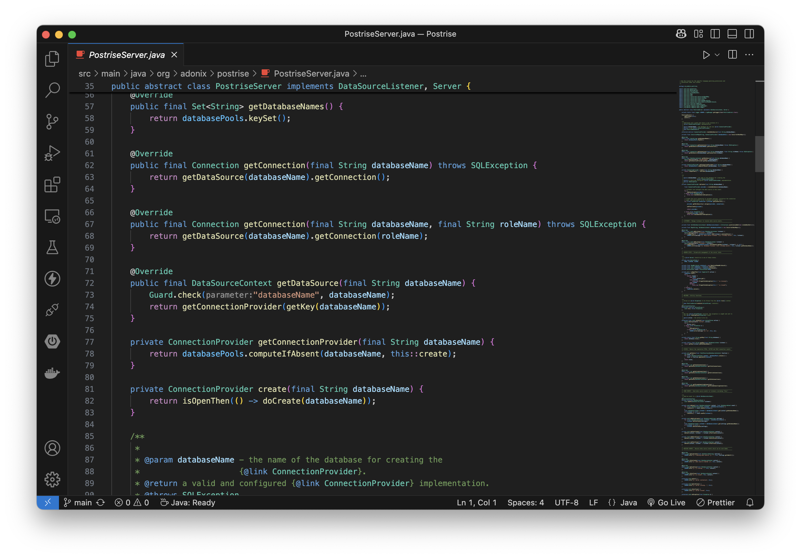

[](https://www.oracle.com/java/technologies/downloads/)
[](https://github.com/adonix-org/postrise/blob/main/LICENSE)
[](https://github.com/adonix-org/postrise/actions/workflows/build.yml)
[](https://sonarcloud.io/summary/overall?id=org.adonix%3Apostrise)
[](https://sonarcloud.io/summary/overall?id=org.adonix%3Apostrise)
[](https://sonarcloud.io/summary/overall?id=org.adonix%3Apostrise)

<a href="https://postrise.adonix.org">
    <picture>
        <source srcset="img/header-dark.png" media="(prefers-color-scheme: dark)">
        </img>
    </picture>
</a>

Get connected *FAST* with **Postrise**, a thread-safe Java library enabling developers to acquire pooled JDBC connections from [PostgreSQL](https://www.postgresql.org). **Postrise** provides a simple, object-oriented solution for configuring data sources while encouraging safe database access. The event-based architecture enables subscriptions to the data source lifecycle. Connection pooling is provided by the exceptional [HikariCP](https://github.com/brettwooldridge/HikariCP) implementation.



## :books: Contents

[Install](#package-install)

[Quickstart](#stopwatch-quickstart)

[Events](#zap-events)

[Security](#lock-security)

[Build](#hammer_and_wrench-build)

<br>

## :package: Install

:bulb: Find the latest **Postrise** version and extra installation snippets in the [Maven Central Repository](https://central.sonatype.com/artifact/org.adonix/postrise).

Add the following to your `pom.xml`:

```xml
<properties>
    <version.postrise>1.0.0</version.postrise>
</properties>

<dependency>
    <groupId>org.adonix</groupId>
    <artifactId>postrise</artifactId>
    <version>${version.postrise}</version>
    <scope>compile</scope>
</dependency>
```

<br>

## :stopwatch: Quickstart

Create and configure a PostgreSQL server and data sources after [Install](#package-install).

:warning: **Postrise** will throw an exception if connecting as a `SUPERUSER`. Refer to the [Security](#lock-security) section for instructions on creating a `NOSUPERUSER` role or bypassing this behavior if necessary.

Create a Java `class` extending [`PostgresServer`](src/main/java/org/adonix/postrise/PostgresServer.java):

```java
import org.adonix.postrise.DataSourceSettings;
import org.adonix.postrise.PostgresServer;

public class MyPostgresServer extends PostgresServer {

}
```

`@Override` superclass methods as needed to connect to your PostgreSQL server.

#### Host

```java
/**
 * Default: "localhost"
 */
@Override
public String getHostName() {
    return "db.mydomain.com";
}
```

#### Port

```java
/**
 * Default: 5432
 */
@Override
public Integer getPort() {
    return 5433;
}
```

#### Before Create

```java
@Override
public void beforeCreate(final DataSourceSettings settings) {

    // Default username is the current OS user.
    settings.setUsername("my_login_user");

    // Set the password or configure secure access using pg_hba.conf
    // for your user.
    settings.setPassword("In1g0M@nt0Ya");

    // For all other settings, it is recommended to begin with
    // the default values.
}
```

:link: See also [pg_hba.conf](https://www.postgresql.org/docs/current/auth-pg-hba-conf.html) and [HikariCP ](https://github.com/brettwooldridge/HikariCP?tab=readme-ov-file#frequently-used)

##

After your server is configured, it can be instantiated. Each data source and connection pool are created on demand when a connection is requested by your application. Your new server implements the `AutoCloseable` interface, and all contained data sources will be closed when the server is closed. The instantiation and closure details of **Postrise** servers will depend on your application, but here is a simple example:

```java
import java.sql.Connection;
import org.adonix.postrise.Server;

public class MyApp {

    // Your PostgreSQL server. Also could be declared in the
    // try-with-resources scope of the application.
    private static final Server server = new MyPostgresServer();

    public static void main(String[] args) throws Exception {
        // A new data source is created on the first connection
        // request to the database.
        try (final Connection connection = server.getConnection("my_database")) {
            // Do something with this connection.
        } finally {
            // Closes the server and all data sources.
            server.close();
        }
    }
}
```

Or if delegating to a `NOLOGIN` role:

```java
try (final Connection connection = server.getConnection("my_database", "my_application_role")) {
    // The current_user for this connection is now "my_application_role".
}
```

<br>

## :zap: Events

The **Postrise** architecture supports subscriptions to the data source and server lifecycle.

Two interfaces are provided for data source events:

-   [`DataSourceListener`](src/main/java/org/adonix/postrise/DataSourceListener.java) - implementations will receive the events for all data sources.

-   [`DatabaseListener`](src/main/java/org/adonix/postrise/DatabaseListener.java) - implementations will only receive data source events for the specified database.

**Postrise** servers implement the [`DataSourceListener`](src/main/java/org/adonix/postrise/DataSourceListener.java) interface and are automatically subscribed to their own data source events.

:bulb: Additional subscribers can be added to your [`Server`](src/main/java/org/adonix/postrise/Server.java) with the `addListener(DataSourceListener)` and `addListener(DatabaseListener)` methods.

:warning: Adding the same listener twice will generate an **error** in the log but will otherwise be ignored.

Events are dispatched to each [`DataSourceListener`](src/main/java/org/adonix/postrise/DataSourceListener.java) in the order they were registered. Your server is always the first listener to receive notifications, followed by any additional [`DataSourceListener`](src/main/java/org/adonix/postrise/DataSourceListener.java) instances. If a [`DatabaseListener`](src/main/java/org/adonix/postrise/DatabaseListener.java) is present, it will be notified last.

Implement these events as needed (the _default_ implementation is no-op):

| **Event**    | **Parameter**                                                                   | **Description**                                                                                                                                                                                                                                                                |
| ------------ | ------------------------------------------------------------------------------- | ------------------------------------------------------------------------------------------------------------------------------------------------------------------------------------------------------------------------------------------------------------------------------ |
| beforeCreate | [DataSourceSettings](src/main/java/org/adonix/postrise/DataSourceSettings.java) | Subscribe to this event to configure the data source. If an exception occurs during data source creation, the data source will be closed, and that exception will be thrown. <br><br>:bulb: This is the most common event to be implemented as it configures each data source. |
| afterCreate  | [DataSourceContext](src/main/java/org/adonix/postrise/DataSourceContext.java)   | The data source has been created successfully.                                                                                                                                                                                                                                 |
| beforeClose  | [DataSourceContext](src/main/java/org/adonix/postrise/DataSourceContext.java)   | The data source will be closed.                                                                                                                                                                                                                                                |
| afterClose   | [DataSourceContext](src/main/java/org/adonix/postrise/DataSourceContext.java)   | The data source is now closed.                                                                                                                                                                                                                                                 |

##

#### Example

`MyDatabaseListener.java`

```java
import org.adonix.postrise.DataSourceSettings;
import org.adonix.postrise.DatabaseListener;

/**
 * MyDatabaseListener will only receive events for the data source with the
 * specified database name.
 */
public class MyDatabaseListener implements DatabaseListener {

    @Override
    public String getDatabaseName() {
        return "my_database";
    }

    @Override
    public void beforeCreate(final DataSourceSettings settings) {
        settings.setUsername("my_login_user");
    }
}
```

`MyPostgresServer.java`

```java
import org.adonix.postrise.DataSourceSettings;
import org.adonix.postrise.PostgresServer;

public class MyPostgresServer extends PostgresServer {

    public MyPostgresServer() {
        /**
         * Register MyDatabaseListener with MyPostgresServer.
         */
        addListener(new MyDatabaseListener());
    }

    /**
     * This event will be dispatched for all data sources. Then if the database name
     * matches MyDatabaseListener, beforeCreate will be called on that listener.
     */
    @Override
    public void beforeCreate(final DataSourceSettings settings) {
        settings.setMaxPoolSize(15);
    }
}
```

##

#### Server Events

Lastly, there are [server-level](src/main/java/org/adonix/postrise/ServerEvents.java) events that may be useful. Override these methods in your server as needed (the default implementation is no-op):

| **Event**   | **Parameter** | **Description**                                                                                                                                                                                                        |
| ----------- | ------------- | ---------------------------------------------------------------------------------------------------------------------------------------------------------------------------------------------------------------------- |
| onInit      |               | Called during server construction.                                                                                                                                                                                     |
| beforeClose |               | Your server is closing. Dispatched **before** any data sources are closed.                                                                                                                                             |
| afterClose  |               | Your server is now closed. Dispatched **after** all data sources are closed.                                                                                                                                           |
| onException | Exception     | An unexpected `Exception` has occurred that should not normally be thrown — for example, while your server or data sources are in the process of closing. <br><br>:bulb: The exception will be logged as an **error**. |

<br>

## :lock: Security

If a non-privileged `ROLE` does not exist, create a secure PostgreSQL `LOGIN` role **without** `SUPERUSER` privileges:

```sql
-- Recreate if exists
DROP ROLE IF EXISTS my_login_user;

-- The LOGIN role is NOSUPERUSER.
CREATE ROLE my_login_user
            LOGIN
            NOSUPERUSER
            NOCREATEDB
            NOCREATEROLE
            NOINHERIT
            NOBYPASSRLS;
```

:bulb: Grant the minimally required permissions to this `ROLE`, or delegate those permissions to a `NOLOGIN` role that the `LOGIN` role can switch to as follows:

```sql
-- Recreate if exists
DROP ROLE IF EXISTS my_application_role;

-- The application role cannot LOGIN.
CREATE ROLE my_application_role
            NOLOGIN
            NOSUPERUSER
            NOCREATEDB
            NOCREATEROLE
            NOINHERIT
            NOBYPASSRLS;

-- Allow the LOGIN user to switch to this ROLE.
GRANT my_application_role TO my_login_user;

-- The application role can only SELECT from my_table.
GRANT SELECT ON my_table TO my_application_role;
```

Use the following SQL to query the session and current users on any connection:

```sql
SELECT session_user, current_user;
```

Example result set:
| **session_user** | **current_user** |
|------------------|------------------|
| my_login_user | my_application_role |

:link: See also [Database Roles](https://www.postgresql.org/docs/current/database-roles.html), [Grant](https://www.postgresql.org/docs/current/sql-grant.html)

##

If `SUPERUSER` connections are _absolutely_ required, disable **Postrise** `ROLE` security as follows:

```java
import static org.adonix.postrise.security.RoleSecurityProvider.DISABLE_ROLE_SECURITY;

import org.adonix.postrise.DataSourceSettings;
import org.adonix.postrise.PostgresServer;

public class MyPostgresServer extends PostgresServer {
    @Override
    public void beforeCreate(final DataSourceSettings settings) {
        settings.setRoleSecurity(DISABLE_ROLE_SECURITY);
    }
}
```

##

Built-in `ROLE` security settings are provided by [`RoleSecurityProvider`](src/main/java/org/adonix/postrise/security/RoleSecurityProvider.java):
| **Name** | **Description** |
| ---------------- | ------------------- |
| POSTGRES_DEFAULT_ROLE_SECURITY | An exception will be thrown if logging in as a `SUPERUSER`. **No check** is performed when getting a connection with a different `ROLE`. |
| POSTGRES_STRICT_ROLE_SECURITY | An exception will be thrown if logging in as a `SUPERUSER` or when switching from the `LOGIN` user to a different `ROLE` with `SUPERUSER`.<br><br>:warning: There will be a performance penalty using STRICT security, so it is recommended for use **only during development**.|
| DISABLE_ROLE_SECURITY | No security checks are performed on any `ROLE`. Use this setting only if `SUPERUSER` is required. |

:bulb: Custom security can be created by implementing the [`RoleSecurityListener`](src/main/java/org/adonix/postrise/security/RoleSecurityListener.java) interface.

##

If your application **does not use** PostgreSQL roles, performance will be improved by disabling **Postrise** `ROLE` management on your server as follows:

```java
import org.adonix.postrise.PostgresDataSourceNoRoles;
import org.adonix.postrise.PostgresServer;

public class MyPostgresServer extends PostgresServer {

    @Override
    protected PostgresDataSource createDataSource(final String databaseName) {
        return new PostgresDataSourceNoRoles(this, databaseName);
    }
}
```

:warning: If roles are disabled, an `UnsupportedOperationException` [will be thrown](src/main/java/org/adonix/postrise/PostgresDataSourceNoRoles.java) when attempting to acquire a connection from **Postrise** with a given `ROLE`.

<br>

## :hammer_and_wrench: Build

**Postrise** is a pure Java library that can easily be cloned and built locally.

The following prerequisites **must** be installed before building:

-   [JDK 11+](https://www.oracle.com/java/technologies/downloads/) - the latest Long-Term Support (LTS) version is [JDK 21](https://www.oracle.com/java/technologies/downloads/#java21).
-   [Maven](https://maven.apache.org/download.cgi) - may already be installed with your IDE.
-   [Docker](https://www.docker.com) - installed and running to perform [JUnit 5](https://junit.org/junit5/) tests.

##

:bulb: Before continuing, use this command to verify the expected Maven and Java versions are on your PATH:

```bash
mvn -v
```

The output should look similar to this with variances for OS and versions:

```bash
Apache Maven 3.9.9 (8e8579a9e76f7d015ee5ec7bfcdc97d260186937)
Maven home: /Users/Inigo/Programs/apache-maven-3.9.9
Java version: 23, vendor: Oracle Corporation, runtime: /Library/Java/JavaVirtualMachines/jdk-23.jdk/Contents/Home
Default locale: en_US, platform encoding: UTF-8
OS name: "mac os x", version: "15.3.2", arch: "aarch64", family: "mac"
```

##

Create a working directory for the **Postrise** project and use the command line to clone the repository into it:

```bash
git clone https://github.com/adonix-org/Postrise.git
```

Next use that same command-line to switch to the **Postrise** folder.

```bash
cd Postrise
```

Finally, run this Maven command to build and test **Postrise**:

```bash
mvn clean verify
```

Or use this Maven command to build, test, and install **Postrise**:

```bash
mvn clean install
```
